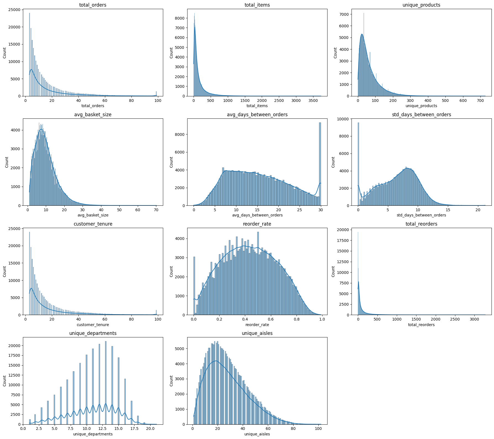
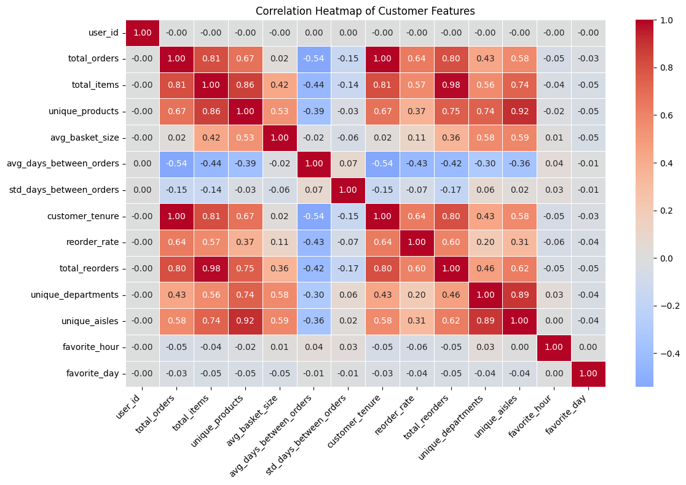
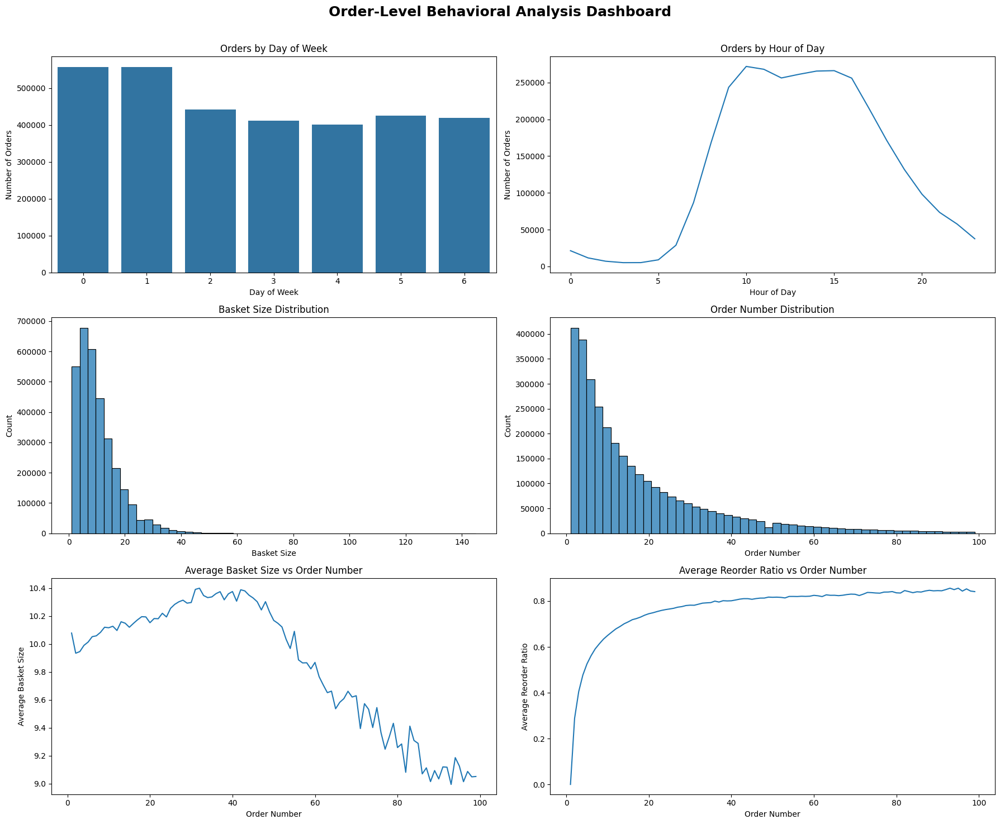
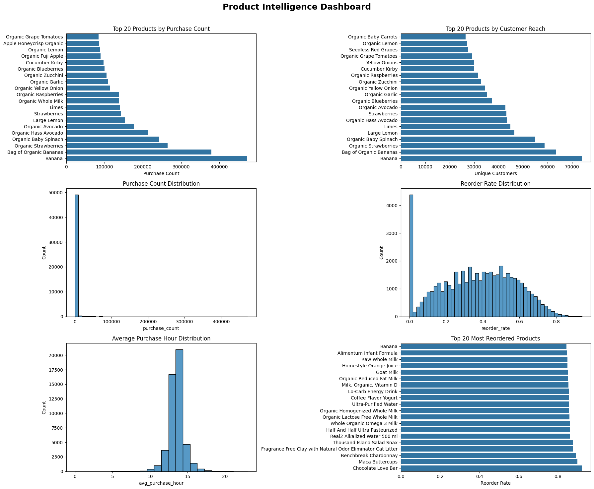
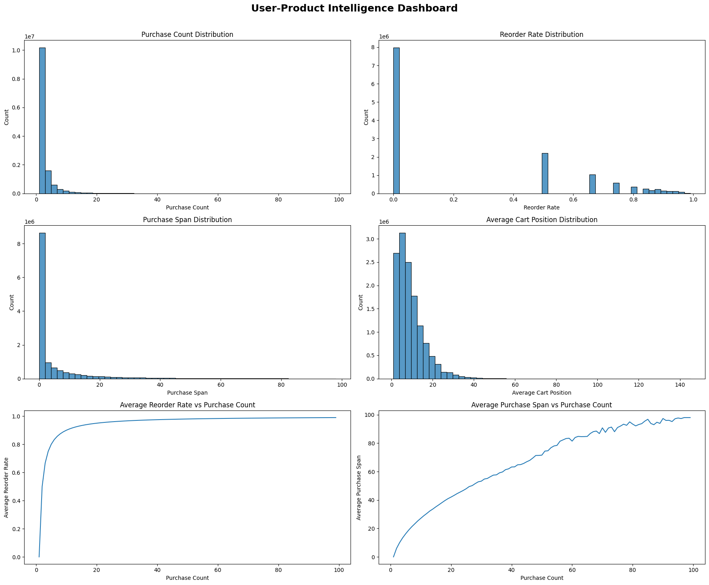
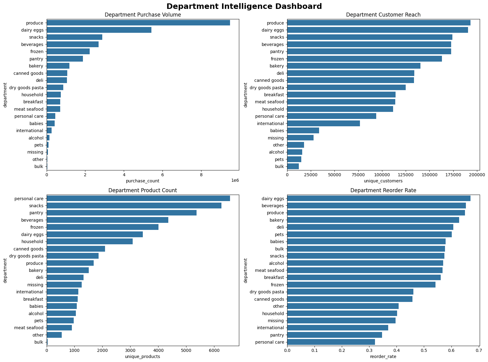
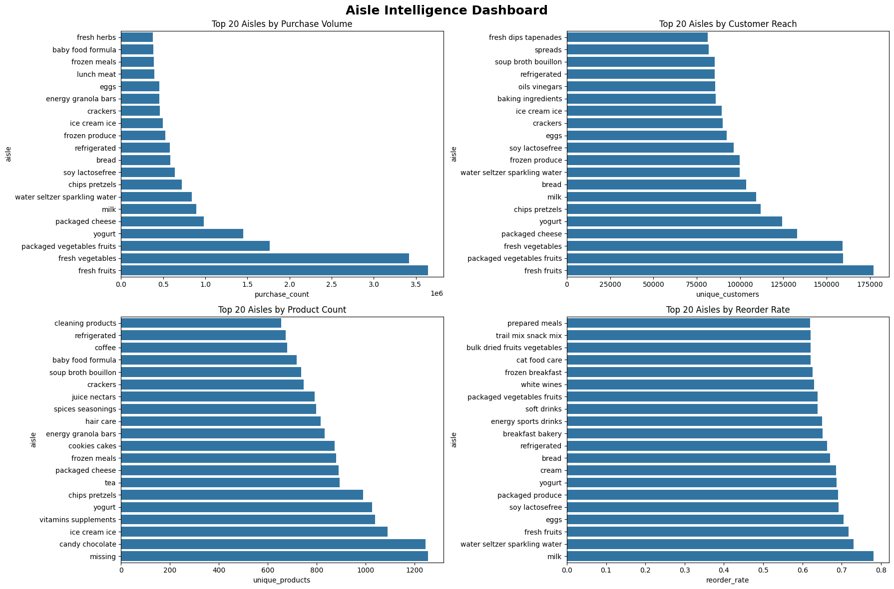

# Feature Store Exploration & Validation

## Overview

This document presents the exploratory analysis and validation of the engineered feature store built on top of the Instacart dataset.

The objective of this analysis is to understand customer behavior, product performance, category dynamics, and customer-product relationships before leveraging these features for machine learning applications such as recommendation systems, customer segmentation, churn prediction, demand forecasting, and personalization.

---

## Feature Tables Explored

| Table                 | Description                                      |
| --------------------- | ------------------------------------------------ |
| customer_features     | Customer-level behavioral and purchasing metrics |
| order_level           | Order-level shopping and temporal behavior       |
| product_features      | Product popularity and reorder intelligence      |
| user_product_features | Customer-product relationship features           |
| department_features   | Department-level performance metrics             |
| aisle_features        | Fine-grained aisle-level shopping intelligence   |

---

# Customer Intelligence

## Customer Behavioral Distributions

### Key Findings

* Customer activity follows a highly skewed distribution.
* Most customers place relatively few orders.
* A small percentage of customers generate a disproportionately large share of platform activity.
* Product diversity and aisle exploration vary significantly across customers.
* Reorder behavior exhibits strong variation across the customer base.

### Business Impact

These patterns indicate natural customer segments ranging from occasional shoppers to highly engaged power users. Such segmentation supports customer lifetime value modeling, retention programs, and personalized marketing strategies.

---

## Customer Feature Correlation Analysis

### Key Findings

* Total Items and Total Reorders exhibit a very strong positive relationship (**r = 0.98**).
* Unique Products and Unique Aisles are highly correlated (**r = 0.92**).
* Frequent customers tend to purchase with shorter intervals between orders.
* Basket size remains relatively independent from purchase frequency.
* Shopping time preferences show limited correlation with purchasing intensity.

### Business Impact

The correlation structure validates the engineered feature set and highlights valuable signals for churn prediction, customer intelligence, and recommendation systems.

---

# Order Intelligence

## Order-Level Behavioral Analysis

### Key Findings

### Weekly Shopping Patterns

Order activity demonstrates clear day-of-week seasonality, indicating predictable shopping cycles.

### Hourly Shopping Behavior

Purchases are concentrated during specific periods of the day, revealing strong temporal shopping habits.

### Basket Size Distribution

Most orders contain relatively small baskets while larger orders become progressively less common.

### Loyalty Development

Average reorder ratios increase with customer order history, suggesting loyalty strengthens as customers continue using the platform.

### Business Impact

These patterns support demand forecasting, inventory planning, operational staffing decisions, and customer retention monitoring.

---

# Product Intelligence

## Product Performance Analysis

### Key Findings

### Long-Tail Product Demand

A small percentage of products generates a significant share of total purchases.

### Produce Category Dominance

Fresh fruits and vegetables consistently rank among the most purchased products on the platform.

### Customer Reach

Top-performing products are purchased by a substantially larger percentage of customers.

### Product Loyalty

Several products demonstrate exceptionally high reorder rates, indicating strong customer affinity and repeat purchasing behavior.

### Business Impact

These products represent stable revenue drivers and ideal candidates for recommendation engines, replenishment reminders, and cross-selling strategies.

---

# User-Product Intelligence

## Customer-Product Relationship Analysis

### Key Findings

### Sparse Interaction Network

Customer-product interactions are highly sparse, a common characteristic of large-scale commerce platforms.

### Loyalty Formation

Reorder probability increases consistently with purchase frequency.

### Long-Term Product Relationships

Customers who repeatedly purchase products tend to maintain those relationships over extended periods.

### Stable Purchasing Patterns

Frequently purchased products occupy consistent positions within customer baskets.

### Business Impact

These relationship signals provide the foundation for collaborative filtering, affinity modeling, personalized recommendations, and customer retention strategies.

---

# Department Intelligence

## Department-Level Performance

### Key Findings

### Purchase Volume Concentration

Produce dominates overall purchase volume, followed by dairy, snacks, beverages, and frozen products.

### Customer Reach

Core grocery departments reach the majority of customers on the platform.

### Reorder Behavior

Departments exhibit significantly different reorder characteristics, reflecting staple versus discretionary purchasing patterns.

### Product Diversity

Departments vary considerably in product assortment size and customer engagement.

### Business Impact

Department-level insights support assortment optimization, merchandising strategies, inventory planning, and category management.

---

# Aisle Intelligence

## Fine-Grained Category Analysis

### Key Findings

### Purchase Concentration

Fresh fruits and vegetables dominate aisle-level purchasing activity.

### Customer Engagement

A relatively small number of aisles account for a significant share of customer activity.

### Reorder Characteristics

Certain aisles consistently demonstrate higher reorder rates than others.

### Category Diversity

Product variety and customer reach differ substantially across aisles.

### Business Impact

Aisle-level intelligence enables more precise recommendation systems and improved understanding of customer shopping intent.

---

# Cross-Domain Insights

## Customer Concentration

A relatively small group of highly engaged customers drives a substantial portion of platform activity.

## Loyalty Strengthens with Engagement

Customers who purchase more frequently consistently demonstrate higher reorder rates and stronger product relationships.

## Product Exploration Drives Category Exploration

Customers who explore more products naturally engage with more departments and aisles.

## Reorder Rate as a Core Signal

Reorder behavior emerges as one of the strongest indicators of customer loyalty and future purchasing activity.

## Predictable Shopping Behavior

Stable weekly and hourly shopping patterns provide strong signals for forecasting and operational planning.

---

# Machine Learning Applications

| Use Case                         | Supporting Tables                        |
| -------------------------------- | ---------------------------------------- |
| Customer Segmentation            | customer_features                        |
| Churn Prediction                 | customer_features, order_level           |
| Recommendation Systems           | user_product_features, product_features  |
| Demand Forecasting               | order_level, product_features            |
| Customer Lifetime Value Modeling | customer_features                        |
| Product Affinity Modeling        | user_product_features                    |
| Personalization Services         | customer_features, user_product_features |

---

# Technology Stack

* Python
* Pandas
* NumPy
* Matplotlib
* Seaborn
* PostgreSQL
* Jupyter Notebook

---

# Conclusion

The exploratory analysis validates the quality, consistency, and business relevance of the engineered feature store.

Strong behavioral patterns emerge across customers, products, departments, aisles, and customer-product relationships, confirming that the feature engineering layer successfully captures meaningful business signals.

These validated features establish a robust foundation for future recommendation systems, customer intelligence services, demand forecasting pipelines, and AI-powered commerce applications within the broader ECommerceAI platform.
